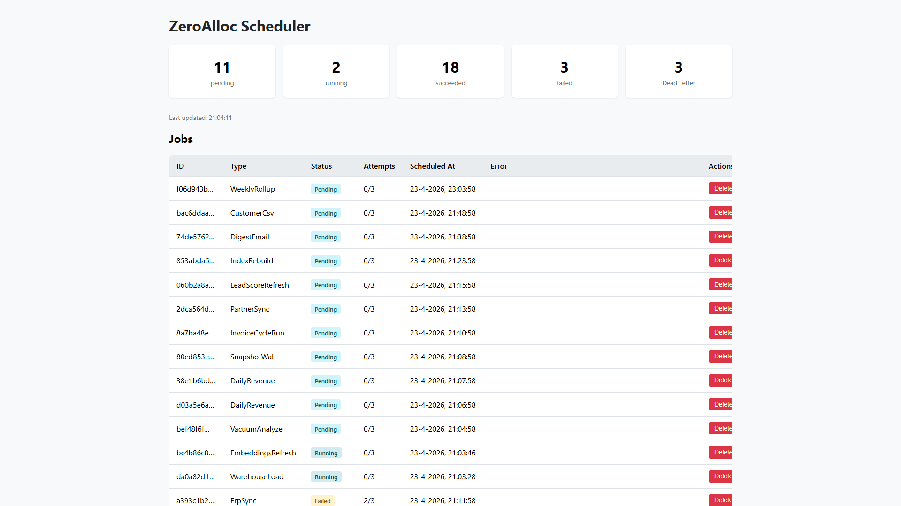

# ZeroAlloc.Scheduling

[](https://www.nuget.org/packages/ZeroAlloc.Scheduling)
[](https://github.com/ZeroAlloc-Net/ZeroAlloc.Scheduling/actions/workflows/ci.yml)
[](LICENSE)

ZeroAlloc.Scheduling is a source-generated background job scheduler for .NET 8 and .NET 10. Decorate any class with `[Job]` and the source generator wires up the executor, DI registration, and recurring startup automatically — no reflection, no convention scanning at runtime.

## Install

```bash
dotnet add package ZeroAlloc.Scheduling
dotnet add package ZeroAlloc.Scheduling.InMemory   # or EfCore / Redis
```

The generator package must be added as an analyzer:

```xml
<PackageReference Include="ZeroAlloc.Scheduling.Generator" Version="*" OutputItemType="Analyzer" ReferenceOutputAssembly="false" />
```

## Example

```csharp
// 1. Define a job — the generator picks it up automatically
[Job(Every = Every.Hour)]
public sealed class CleanupExpiredSessionsJob : IJob
{
    private readonly ISessionRepository _repo;
    public CleanupExpiredSessionsJob(ISessionRepository repo) => _repo = repo;

    public async ValueTask ExecuteAsync(JobContext ctx, CancellationToken ct)
        => await _repo.DeleteExpiredAsync(ct);
}

// 2. Register — generated AddCleanupExpiredSessionsJob() wires executor + recurring startup
services.AddScheduling()
        .AddSchedulingInMemory()
        .AddCleanupExpiredSessionsJob();

// 3. Enqueue a one-off job from application code
public class OrderService(IScheduler scheduler)
{
    public async Task CompleteOrderAsync(Order order, CancellationToken ct)
    {
        await ProcessAsync(order, ct);
        await scheduler.EnqueueAsync(new SendOrderConfirmationJob(order.Id), ct);
    }
}
```

## Features

- **Source generator** — `[Job]` on a class emits a typed executor, DI extension method, and optional recurring startup (`IHostedService`)
- **Recurring jobs** — `[Job(Cron = "0 * * * *")]` or `[Job(Every = Every.Hour)]` — scheduled via Cronos at startup
- **Retry with backoff** — exponential retry up to `MaxAttempts` (per-job or global); dead-letters after exhaustion
- **Multiple backends** — InMemory (dev/test), EF Core (SQL Server / PostgreSQL / SQLite), Redis
- **Dashboard** — embedded HTML/JS dashboard via `app.MapJobsDashboard("/jobs")`
- **Blazor component** — `<JobsDashboard>` Razor component for integration into Blazor apps
- **Mediator bridge** — `[Job]` + `IRequest<Unit>` auto-registers `MediatorJobTypeExecutor<T>`, routing execution through ZeroAlloc.Mediator pipeline behaviors
- **Native AOT compatible** — no reflection at runtime; all dispatch resolved at compile time

## Dashboard

An embedded HTML/JS dashboard — summary cards for each job state, a live-refreshing table with per-row requeue / delete actions, and fully responsive down to mobile widths.

```csharp
app.MapJobsDashboard("/jobs");

// Optional: protect with auth
app.MapJobsDashboard("/jobs").RequireAuthorization("AdminPolicy");
```



Tablet (768 × 1024) and mobile (375 × 812) captures live in [`docs/screenshots/`](docs/screenshots/).

See [Dashboard](docs/dashboard.md) for the full endpoint reference and the Blazor component.

## Packages

| Package | Description |
|---------|-------------|
| `ZeroAlloc.Scheduling` | Core interfaces, worker service, scheduler |
| `ZeroAlloc.Scheduling.Generator` | Source generator (analyzer reference) |
| `ZeroAlloc.Scheduling.InMemory` | In-process store for development and testing |
| `ZeroAlloc.Scheduling.EfCore` | EF Core store (SQL Server, PostgreSQL, SQLite) |
| `ZeroAlloc.Scheduling.Redis` | Redis store for distributed deployments |
| `ZeroAlloc.Scheduling.Dashboard` | Embedded HTML dashboard (`MapJobsDashboard`) |
| `ZeroAlloc.Scheduling.Dashboard.Blazor` | Blazor component library |
| `ZeroAlloc.Scheduling.Mediator` | ZeroAlloc.Mediator bridge |

## Documentation

| Page | Description |
|------|-------------|
| [Getting Started](docs/getting-started.md) | Install and schedule your first job in five minutes |
| [Source Generator](docs/source-generator.md) | `[Job]`, `Every`, `Cron`, generated extension methods |
| [Backends](docs/stores.md) | InMemory, EF Core, and Redis store configuration |
| [Dashboard](docs/dashboard.md) | Embedded HTML dashboard and Blazor component |
| [Mediator Bridge](docs/mediator-bridge.md) | Route job execution through ZeroAlloc.Mediator |
| [Diagnostics](docs/diagnostics.md) | ZASCH001 compiler warning reference |
| [Performance](docs/performance.md) | Throughput, allocation profile, and tuning guide |

## License

MIT
